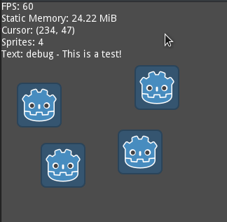

# godot-debug-overlay
A simple debug overlay singleton based on Gonkee's tutorial: https://youtu.be/8Us2cteHbbo



## Installation

Add the `DebugOverlay.gd` and `DebugOverlay.tscn` files to your `addons/debug-overlay` folder. Alternatively, you can download it from the Asset Library: https://godotengine.org/asset-library/asset/645

## Use

The `DebugOverlay.tscn` scene can either be added to your game as an AutoLoad or added as a child to a camera. An example of adding monitors to an AutoLoad singleton can be done like so:

```python3
DebugOverlay.visible = true
# Add a property monitor
DebugOverlay.add_monitor("Cursor X", self, "Sprite:global_position:x")
# Add a function (from "self") monitor
DebugOverlay.add_monitor("Sprites", self, "", "get_sprite_count")
# Add a function (from "self") monitor with arguments
DebugOverlay.add_monitor("Text", self, "", "get_debug_text", ["This is a test!"])
```

Additional demos are available in the `addons/debug-overlay/demo` folder.

Icon: (CC0 1.0 Universal) [Kenney](https://twitter.com/KenneyNL/)
